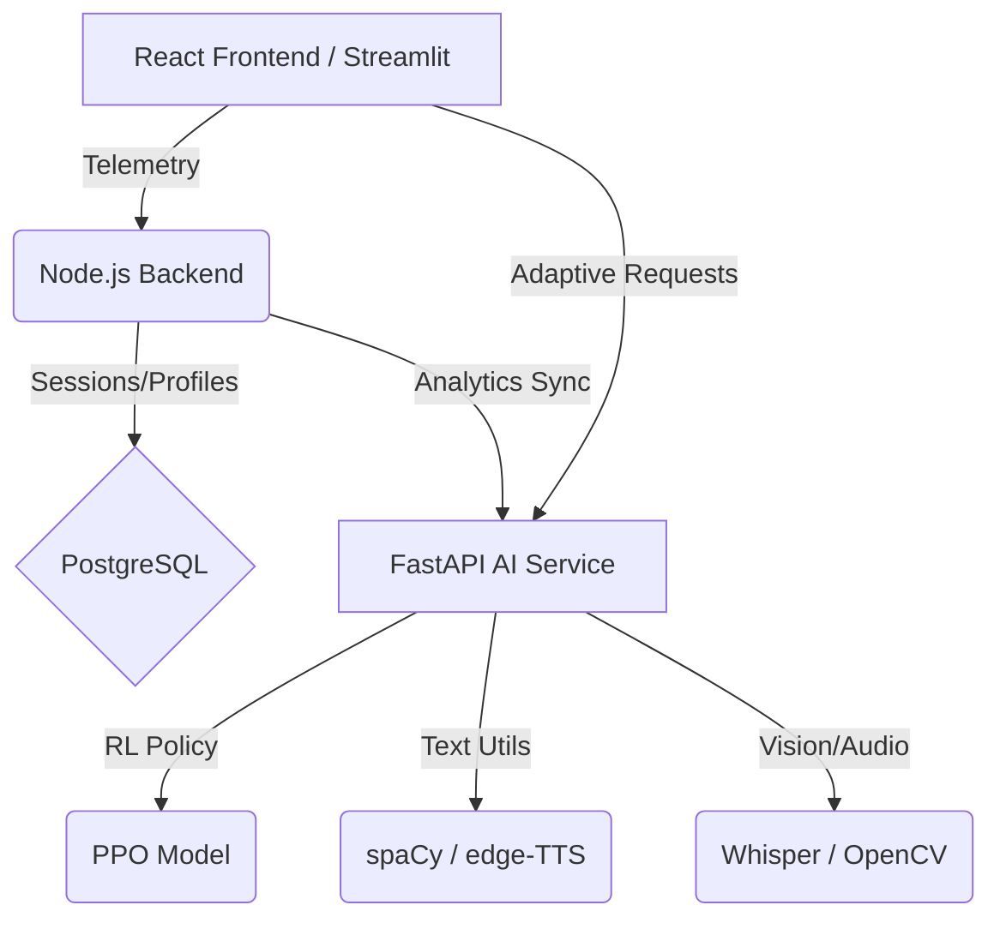

# IncludEd 2.0 - AI-Powered Adaptive Learning Platform

IncludEd 2.0 is a specialized educational ecosystem designed to support primary school students (P3-P6) in Rwanda who have learning differences such as **Dyslexia** and **ADHD**. 

The platform uses **Reinforcement Learning (RL)** to dynamically adapt educational content (text simplifications, syllable breaks, TTS, and focus prompts) based on real-time student interaction telemetry.

## 🏗️ System Architecture

The platform follows a distributed microservices pattern to separate concerns between business logic, AI processing, and testing interfaces.



### Core Services
1.  **Node.js Backend (Port 3000)**: Manages users, student profiles, reading session history, and provides the main API for the React frontend.
2.  **Python AI Service (Port 8080)**: The "Brain" of the project. Built with FastAPI, it hosts the PPO (Proximal Policy Optimization) agent and all accessibility tools (TTS, Transcription, Simplification).
3.  **Streamlit Portal (Port 8501)**: A dedicated testing and monitoring UI used for simulating sessions, inspecting the RL agent's behavior, and verifying accessibility features.

---

## 🧠 AI & Reinforcement Learning Logic

The core innovation is the **Closed-Loop Adaptation Engine**.

### 1. The State Vector (8 Dimensions)
The AI perceives the student's state through a normalized vector:
- `[reading_speed, mouse_dwell, scroll_hesitation, backtrack_freq, attention_score, disability_type, text_difficulty, session_fatigue]`

### 2. Action Space (Pedagogical Interventions)
Based on the state, the RL agent selects one of 6 actions:
- `0: Keep Original`
- `1: Light Simplification`
- `2: Heavy Simplification`
- `3: TTS + Synchronized Highlights`
- `4: Syllable Break Adaptation`
- `5: Mandatory Attention Break`

### 3. Reward Function
The agent is trained to maximize a reward based on **Attention Stability** and **Quiz Performance**. It is penalized for causing high "fatigue" (over-adapting) or allowing "attention lapses".

---

## 🚀 API Reference (AI Service)

| Endpoint | Method | Description |
| :--- | :--- | :--- |
| `/adapt-text` | `POST` | Takes text and disability profile; returns adapted text + chosen RL strategy. |
| `/tts/generate` | `POST` | Generates MP3 audio + **word-level timestamps** for synchronized highlighting. |
| `/video/transcribe` | `POST` | Transcribes video/audio to `.vtt` format for accessible captions. |
| `/session/telemetry` | `POST` | Receives live telemetry; returns the next RL-recommended intervention. |

---

## 🛠️ Setup & Development

### 1. Prerequisites
- Node.js (v18+) & Python 3.11+
- `ffmpeg` (required for video transcription)

### 2. Startup Sequence
1.  **Database**: `docker-compose up -d` (Postgres on 5432)
2.  **Backend**: `cd backend && npm install && npm run dev`
3.  **AI Service**: 
    ```bash
    cd ai-service
    pip install -r requirements.txt
    python main.py
    ```
4.  **Testing UI**: `cd streamlit_app && streamlit run app.py`
5.  **Frontend**: `cd frontend && npm install && npm run dev`

---

## 📜 Research Context
This project serves as the technical implementation for the **ALU BSc. Software Engineering Capstone (2026)**. It focuses on solving the achievement gap for neurodivergent learners in the Rwandan context.

**Lead Developer**: Ivan Shema